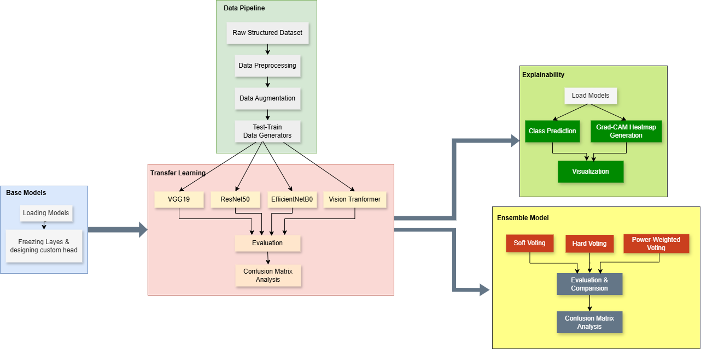
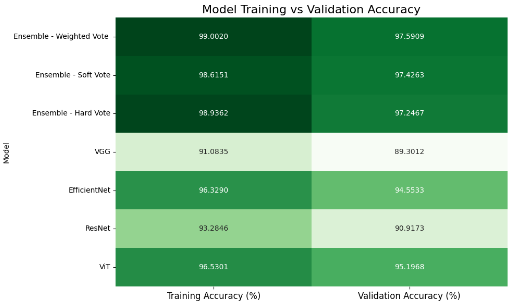

# Ensemble-Model-for-Image-Classification

This repository presents an end-to-end image classification workflow using ensemble learning techniques and explainable AI. The primary objective is the **classification of tomato leaf diseases**, an essential task in precision agriculture for early disease detection and crop management.

The system leverages transfer learning from multiple deep learning models and combines their predictions using ensemble strategies to improve classification accuracy and robustness.

> All training, evaluation, and visualization are performed in **Google Colab**.

---

## 📌 Workflow Overview

---

## Dataset

The dataset used is sourced from Kaggle:  
`ashishmotwani/tomato`

---

## 🔍 Project Highlights

### Data Pipeline
- Raw structured tomato leaf image dataset
- Preprocessing, augmentation, and train-test data generation

### Transfer Learning Models
- **VGG19**
- **ResNet50**
- **EfficientNetB0**
- **Vision Transformer**

Each model is:
- Loaded with pre-trained weights
- Fine-tuned with a custom classification head on the dataset
- Evaluated individually using confusion matrix analysis
- Saved on the drive for ensemble results.
  
### Ensemble Learning
- **Soft Voting**
- **Hard Voting**
- **Power-Weighted Voting**

Predictions from individual models are aggregated using the above strategies and compared for performance.

### Explainability (Grad-CAM)
- Grad-CAM is used to visualize class activation regions for model predictions
- Provides insight into the decision-making process of the trained models

---

## Evaluation

- Accuracy, Precision, Recall for each class for all the models.
- Confusion matrix for each models.
- Performance comparison of ensemble methods
- Visual explanations using Grad-CAM technique.

---

## 📊 Results
The table below presents the accuracy results achieved by integrating all four models, highlighting the performance improvements gained through ensemble techniques.

**Observation**:  
Ensemble methods significantly outperformed individual models, especially in terms of validation accuracy. The weighted voting ensemble achieved the highest generalization performance (97.73% accuracy), demonstrating the effectiveness of combining model predictions.

---

